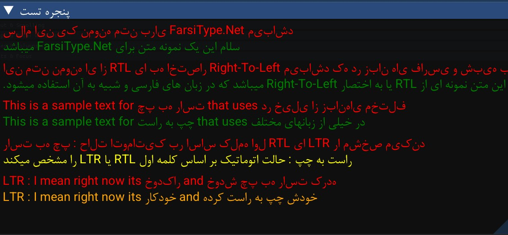

# FarsiType.NET
This is a simple .NET library designed to support **RTL Farsi-like** languages (such as Arabic).

## Showcase


## Usage
```csharp
class Program
{
  public static void Main(string[] args)
  {
        
    // Sometimes farsi fonts does not support isolated letters so you should use
    FarsiTypeNet.FarsiType.SetUseIsolated(false);


    // This is the main method but you can use others if u want
    // Converts a string to its contextual Farsi glyph representation and applies the specified text order.
    string str = FarsiTypeNet.FarsiType.GetFarsiGlyph("سلام حالت خوبه؟", FarsiOrder.Default);

    // do whatever you want
  }
}
```
# About
I wanted to use RTL text in [ImGui.NET](https://github.com/ImGuiNET/ImGui.NET) (.NET wrapper for [dear imgui](https://github.com/ocornut/imgui)) and tried several approaches, but none were satisfactory. Then, I discovered a C++ project called [FarsiType](https://github.com/AmyrAhmady/FarsiType/), which inspired me to create a similar solution for .NET in C#.
## compatibility
- .net-standard2.1
- .net8.0, 9.0, above
- Native Aot Compatible ( So every language that supports C/CPP )
